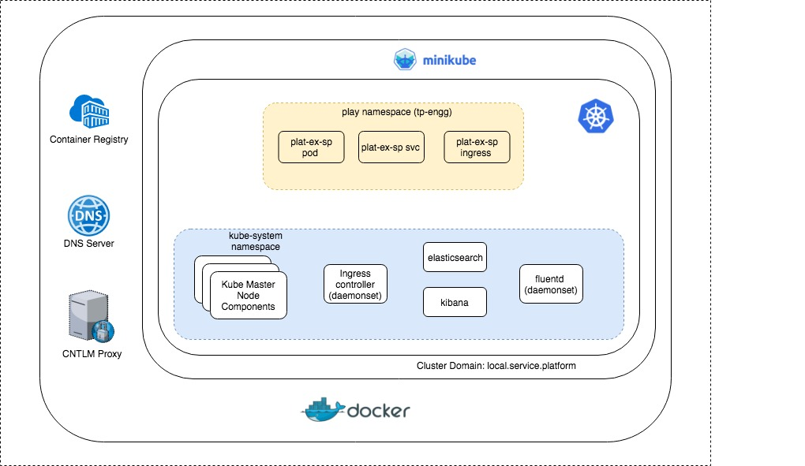

# Kubernetes Cluster  

## Desktop Setup configuration
* Kubernetes Cluster : minikube
* Docker Registry: local docker registry running on the host machine (outside of the kubernetes cluster)
* DNS : Local DNS server to setup and route requests for the kubernetes cluster domain
* Internet access (from the cluster, to download docker images etc) : local cntlm proxy

## Design Assumptions

### Kubernetes Cluster
* A kubernetes cluster can be on a per team basis or can be shared across multiple teams
* In either case, each team (XFT/product line) will be provided a dedicated namespace to use for their microservices
* Each kubernetes cluster will be provided a specific base cluster domain - e.g. local.service.platform
* Each namespace will be assigned a specific sub-domain within the cluster domain
  * e.g. for the kube-system namespace - system.local.service.platform
  * This is essential as unlike in PCF - kubernetes cluster doesn't validate independent routes
* For the product-line namespaces - the default is to use the same sub-domain and namespace
  * e.g. for the TP engg., the namespace would be tech & sub-domain tech.local.service.platform
* Mapping of PCF constructs to Kubernetes Cluster
  * PCF Organization : Kubernetes Namespace
  * PCF Space : {no direct mapping} all apps run in a common namespace. config and urls can be configured across diff. lifecycle stages of the app
  * PCF domain : Kubernetes cluster base domain
  * App domain : (in PCF this is same as PCF domain) product-line subdomain under the kubernetes base domain

### Docker Registry / Images
* A set of base images will be created / maintained centrally that provide support for the common image requirements
  * Security verification of images
  * Support for root org certs
  * AppDynamics agent
* All microservice images need to be built against the base images only
* The creation of the docker image will be transperent to the application teams
  * A set of dockerfiles for different application types (springboot, mule, etc) will be configured to pull the application component and package it into the image
  * For day 1 - application teams will NOT be able to make changes to the docker file / docker image generation process - will be handled by the pipeline
